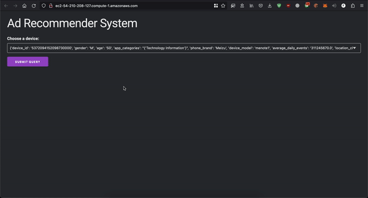
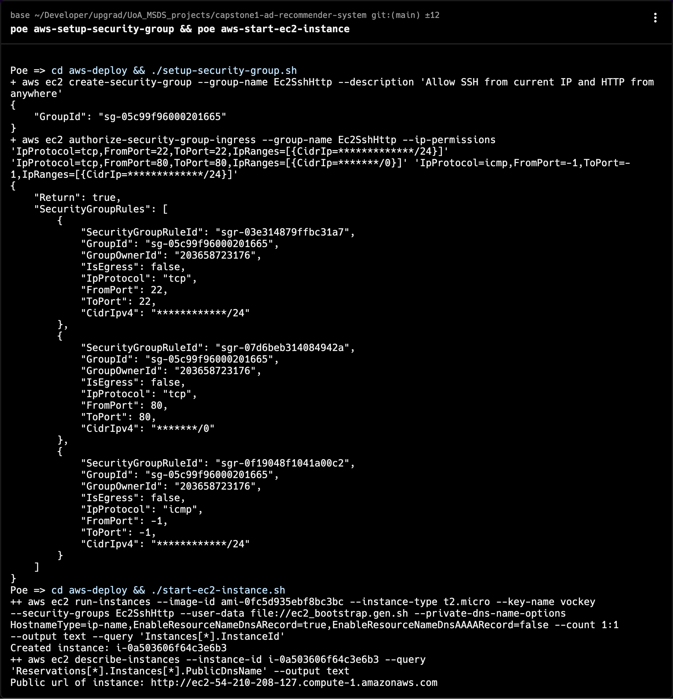

# Ad Recommender System




## Foreword

The whole project is also backed up to Github at [InNoobWeTrust:UoA_MSDS_projects/tree/main/capstone1-ad-recommender-system](https://github.com/InNoobWeTrust/UoA_MSDS_projects/tree/main/capstone1-ad-recommender-system).

To view this README using web browser install `grip` and use it to render this README like what Github does

```sh
pip install grip
```
```sh
grip README.md
```

Then open the link shown in the output, or open another shell tab and execute this command to open it automatically
```sh
open http://localhost:6419
```

## Modeling part

The modeling is executed on Google Colab environment, raw data is fetched from S3 and all the models and derived data are saved to Google Drive.

After modeling, simply download the files inside `deploy` directory of Google Drive into `data` directory in this repository.

The notebooks are downloaded into `colab-notebooks` directory for reference.

The notebooks are also exported into PDF files in `doc/pdf/`, each contains explanations for each step taken.

- [doc/pdf/Task1.1+2+3_Read_Clean_EDA.pdf](doc/pdf/Task1.1+2+3_Read_Clean_EDA.pdf)
- [doc/pdf/Task1.4_Advance_visualization_and_clustering.pdf](doc/pdf/Task1.4_Advance_visualization_and_clustering.pdf)
- [doc/pdf/Task1.5_Model_building.pdf](doc/pdf/Task1.5_Model_building.pdf)
- [doc/pdf/Task1.6_Model_Evaluation.pdf](doc/pdf/Task1.6_Model_Evaluation.pdf)

The models are exported using `dill` to embed the imports to correct libraries and also embed the custom Python code that is used in the pipeline.

The label encoders are also exported to convert back the numeric predictions to label names.

The models used in deployments are not tuned with best hyper parameters. Due to time constraint, the models are tuned quickly using randomized search so the performance is just slightly better than random guess. To achieve better performance, switch to `GridSearch` in `colab-notebooks/Task1.5_Model_building.ipynb` and run the notebook again on Colab pro plan, as the training time estimated is around or more than half a day and require more powerful machine to run.

Nevertheless, as the base performance is already not so good, tuning is not likely to boost the performance much. The better strategy is to combine more types of classifiers in stacking models to better learn the patterns from data, and also find some good derived features to add to input data for training.

## Deployment part

### Prerequisite
Install Poetry

- With pipx
```sh
pip install pipx
pipx install poetry
```
- With official installer
```sh
curl -sSL https://install.python-poetry.org | python3 -
```

Install task runner `poethepoet`
```sh
pipx install poethepoet
```

Install dependencies with poetry
```sh
poetry install
```

### Run locally

Start flask server
```sh
poe dev
```
Then go to [http://localhost:5000](http://localhost:5000) to interact with the app

Or view a fancy UI using streamlit
```sh
poe streamlit-run
```

### Run with docker

```sh
poe docker-dev
```

Stop docker container with

```sh
poe docker-stop
```

### Run test

__Note:__ Only test case is the test to check if the pickled input processor is working to ensure the deployment matches the environment in Colab's noteboook when building the models.

To run test:
```sh
poe test
```

### Format code with Ruff

```sh
poe ruff-fix
```

### Deploy to AWS EC2

Copy `aws-deploy/.env.example` to `aws-deploy/.env`

Edit `aws-deploy/.env` with public S3 bucket that you has access to upload and the name of ssh key you created in AWS console.
```dotenv
KEY_NAME=vockey
S3_BUCKET=a_unit_of_data_that_can_be_transferred_from_a_backing_store_in_a_single_operation
```

Build and push docker image to S3 (You will need to setup aws-cli credentials locally to be able to run this)
```sh
poe push-docker-s3
```
__Note:__ Alternative way is to upload the docker image manually to bucket using AWS Console
```sh
docker save -o ad-rec-flask.tar ad-rec-flask:latest
```
Then upload the tar file under the folder named `docker-registry` in your S3 bucket

Setup security group for ec2 instance
```sh
poe aws-setup-security-group
```

Start EC2 instance (the S3 bucket need to be public in order for EC2 to download docker image from it)
```sh
poe aws-start-ec2-instance
```

After the instance is started, the script will print DNS address, use it to get a HTTP link to the app that you just deployed.
__Note:__ Even with the link, you will need to wait and refresh a few times as the setup process can take a couple of minutes.



To stop EC2 instance
```sh
poe aws-terminate-ec2-instance
```

To cleanup security group that we created for EC2
```sh
poe aws-cleanup-security-group
```
